# Báo cáo — Nhận dạng khuôn mặt bằng CNN và Vision Transformer

**Sinh viên:** Cao Anh Tuan  
**MSHV:** 25C01025  
**Môn:** Computer Vision — bài tập lập trình 2  
**Source code:** https://github.com/tuancaokaizen/hcmus_computer_vision (thư mục `CNN_computer_vision`)

## 1. Giới thiệu

Giữ nguyên bài toán của bài 1: nhận dạng danh tính (closed-set) trên **Olivetti Faces** — 40 người × 10 ảnh xám 64×64. Bài 1 dùng đặc trưng truyền thống (Eigenfaces, Fisherfaces, LBP, HOG + SVM/kNN), tốt nhất 97.5%. Bài này giải bằng **CNN** (train từ đầu và fine-tune ResNet, MobileNet) và **Vision Transformer** (DeiT-Tiny), với **cùng cách chia dữ liệu** để so sánh trực tiếp.

## 2. Dữ liệu và giao thức

- Split giống bài 1: `train_test_split(test_size=0.2, stratify=y, random_state=42)` → 320 train / 80 test (2 ảnh/người).
- Trong 320 ảnh train: 280 train + 40 validation (1 ảnh/người) để chọn epoch tốt nhất (val accuracy cao nhất, hoà thì val loss thấp hơn).
- Sau đó **huấn luyện lại trên đủ 320 ảnh** với số epoch đã chọn → model cuối thấy đúng lượng dữ liệu như bài 1.
- 80 ảnh test chỉ dùng một lần để đánh giá.

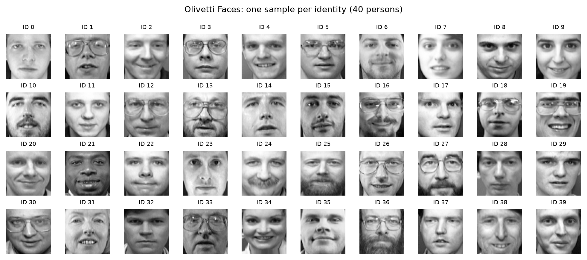

## 3. Phương pháp

### 3.1. Tiền xử lý và augmentation

- Model pretrained: resize 64→224, nhân 3 kênh, chuẩn hoá theo thống kê ImageNet. SimpleCNN: giữ 64×64×1.
- Augmentation (chỉ khi train): lật ngang, xoay ±10°, dịch ±6%, scale 0.93–1.07, độ sáng/tương phản ±25%.
- Không dùng histogram equalization như bài 1 — mạng tự học bất biến về ánh sáng.

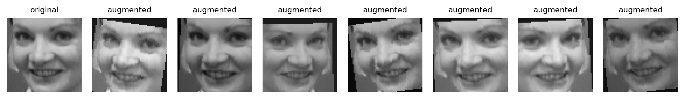

### 3.2. Các model

| Model | Ý tưởng chính | Tham số |
|---|---|---|
| SimpleCNN | 3 khối [conv3×3-BN-ReLU]×2 + max-pool (32/64/128 kênh), GAP, dropout 0.3; train từ đầu | 0.29M |
| ResNet-18 (He et al., 2016) | khối residual, 4 stage, embedding 512 chiều; ImageNet | 11.2M |
| MobileNetV3-Small (Howard et al., 2019) | depthwise-separable, squeeze-and-excitation, hard-swish; ImageNet | 1.56M |
| DeiT-Tiny (Touvron et al., 2021) | ViT: patch 16×16 (196 token + CLS), 12 lớp, 3 head, 192 chiều; ImageNet | 5.53M |

Với model pretrained, thay lớp phân loại ImageNet bằng lớp tuyến tính 40 lớp và **fine-tune toàn bộ** trọng số.

### 3.3. Huấn luyện

| Model | Input | LR | Epoch tối đa |
|---|---|---|---|
| SimpleCNN | 64×64×1 | 3e-3 | 60 |
| ResNet-18 | 224×224×3 | 3e-4 | 25 |
| MobileNetV3-S | 224×224×3 | 1e-3 | 30 |
| DeiT-Tiny | 224×224×3 | 2e-4 | 25 |

Chung: cross-entropy + label smoothing 0.1, AdamW (weight decay 0.05), cosine LR, batch 32, seed 42. Chạy trên GPU Apple (MPS), toàn bộ khoảng 4 phút.

### 3.4. Minh hoạ đặc trưng

- **Feature map**: kích hoạt sau stem và từng stage của ResNet-18.
- **Grad-CAM**: trọng số kênh = gradient trung bình của lớp conv cuối theo lớp dự đoán.
- **Attention rollout** (DeiT): trung bình các head, cộng identity (residual), nhân qua 12 lớp → bản đồ 14×14 từ token CLS.
- **t-SNE**: chiếu embedding (input của lớp tuyến tính cuối) của 400 ảnh xuống 2D.

## 4. Kết quả

| Model | Accuracy | KTC 95% | Precision | Recall | F1 | Sai | ms/ảnh |
|---|---|---|---|---|---|---|---|
| SimpleCNN | 95.00% | 87.7–98.6 | 0.967 | 0.950 | 0.947 | 4 | 0.37 |
| ResNet-18 | **100%** | 95.5–100 | **1.000** | **1.000** | **1.000** | 0 | 1.56 |
| **MobileNetV3-S** | **100%** | 95.5–100 | **1.000** | **1.000** | **1.000** | 0 | 1.96 |
| DeiT-Tiny | 98.75% | 93.2–100 | 0.992 | 0.988 | 0.987 | 1 | 1.21 |
| Eigenfaces+SVM (bài 1) | 97.50% | 91.3–99.7 | 0.983 | 0.975 | 0.973 | 2 | — |

Precision / Recall / F1 lấy trung bình macro trên 40 người. KTC = khoảng tin cậy Clopper–Pearson. Thời gian suy luận: batch 32 trên MPS, sau warm-up.

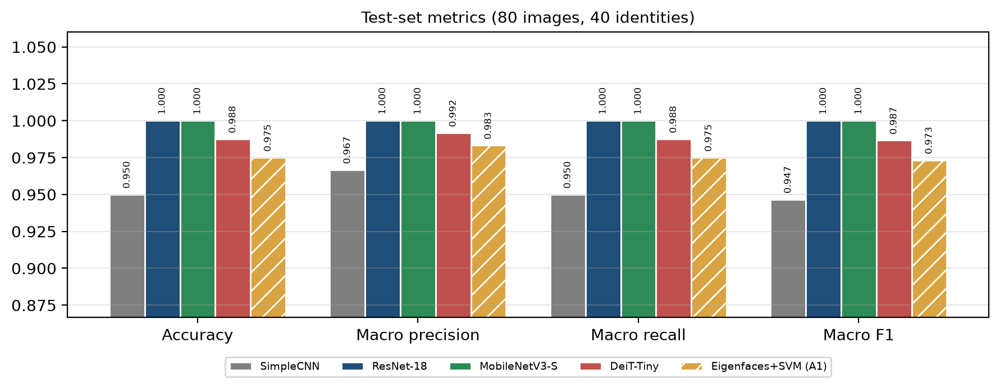

- Hai CNN pretrained **không sai ảnh nào**; DeiT-Tiny sai 1; SimpleCNN sai 4.
- Cả ba model pretrained đều vượt Eigenfaces+SVM (97.5%); CNN train từ đầu (95%) chỉ ngang SVM trên pixel thô ở bài 1.
- **Model đề xuất: MobileNetV3-Small** — cùng 100% với ResNet-18 nhưng ít tham số hơn 7 lần.
- Lưu ý thống kê: test chỉ 80 ảnh (1 lỗi = 1.25 điểm), các khoảng tin cậy chồng nhau nên không kết luận được model nào hơn có ý nghĩa thống kê. Khác biệt rõ nhất là giữa pretrained và train từ đầu.

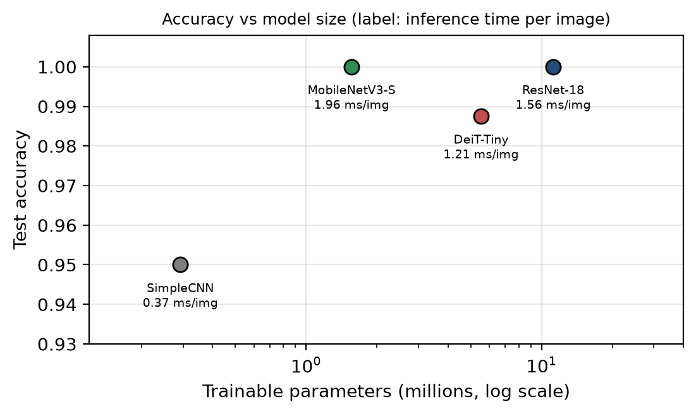

### 4.1. Quá trình huấn luyện

Model pretrained hội tụ rất nhanh: ResNet-18 đạt 100% validation ở epoch 4, DeiT-Tiny ở epoch 10, MobileNetV3-S ở epoch 27 (val loss cao trong ~10 epoch đầu). SimpleCNN cần ~45 epoch để đạt 95% và dao động mạnh — dấu hiệu thiếu dữ liệu khi train từ đầu. Train loss dừng quanh 0.7 do label smoothing.

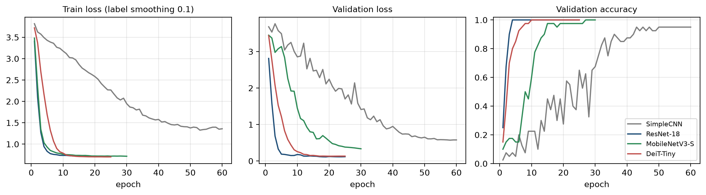

### 4.2. Confusion matrix

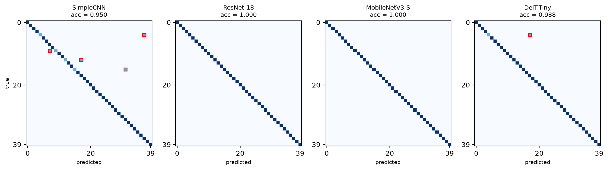

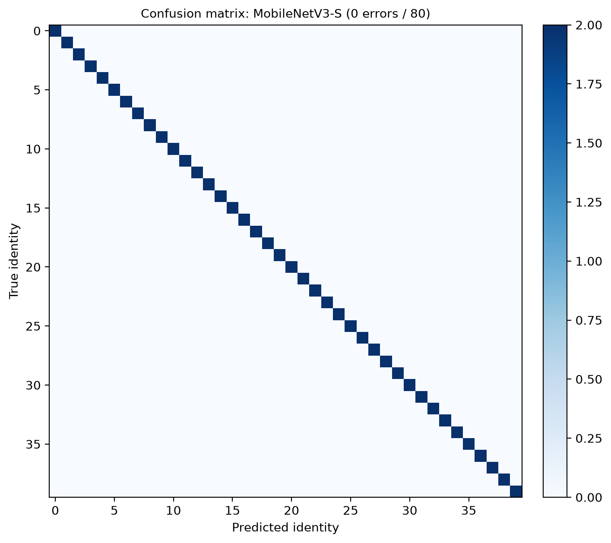

### 4.3. Precision / Recall theo từng người

Mỗi lỗi của SimpleCNN làm recall của người thật giảm còn 0.50 (ID 4, 9, 12, 15) và precision của người bị đoán nhầm còn 0.67 (ID 7, 17, 31, 37). Mỗi người chỉ có 2 ảnh test nên giá trị theo lớp chỉ dùng để định vị lỗi.

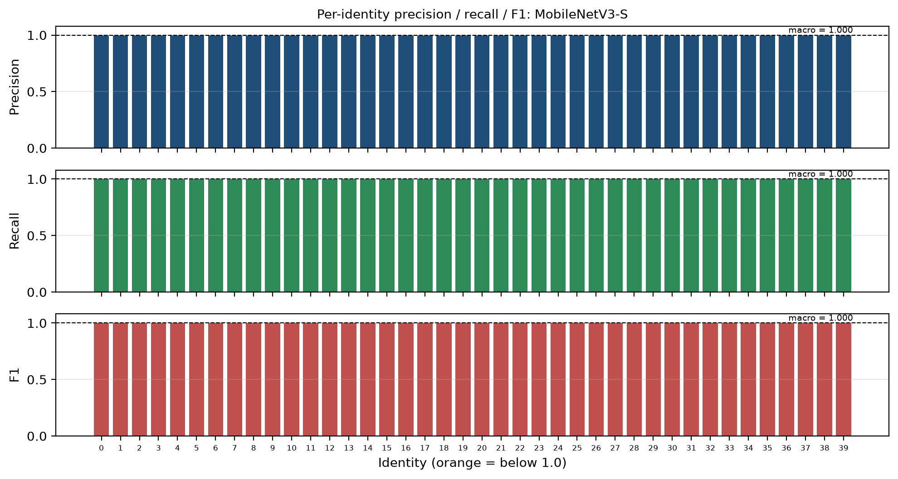

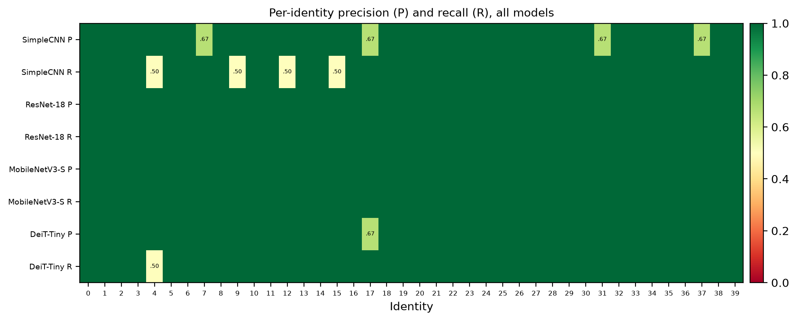

### 4.4. Phân tích lỗi

Năm lỗi của tất cả model, đặt cạnh ảnh train của người bị đoán nhầm. ID 4 và ID 17 rất giống nhau (lỗi duy nhất của DeiT). ID 4 cũng bị SimpleCNN và Eigenfaces+SVM (bài 1) đoán sai; lỗi 9→7 của SimpleCNN trùng với một lỗi của Eigenfaces+SVM → một phần độ khó nằm ở dữ liệu.

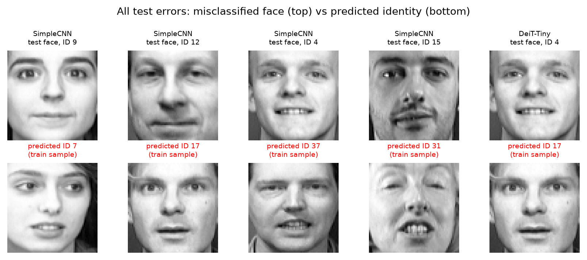

## 5. Mạng học được gì

### 5.1. Feature map

Stem và `layer1` phản ứng với cạnh và tương phản (gọng kính, lông mày, mũi, miệng); `layer2`–`layer3` cho đáp ứng thưa, giống bộ phận khuôn mặt; `layer4` (7×7) tập trung vào vùng giữa khuôn mặt. Hệ phân cấp cạnh → bộ phận này được học tự động, trong khi bài 1 phải thiết kế tay (HOG, LBP).

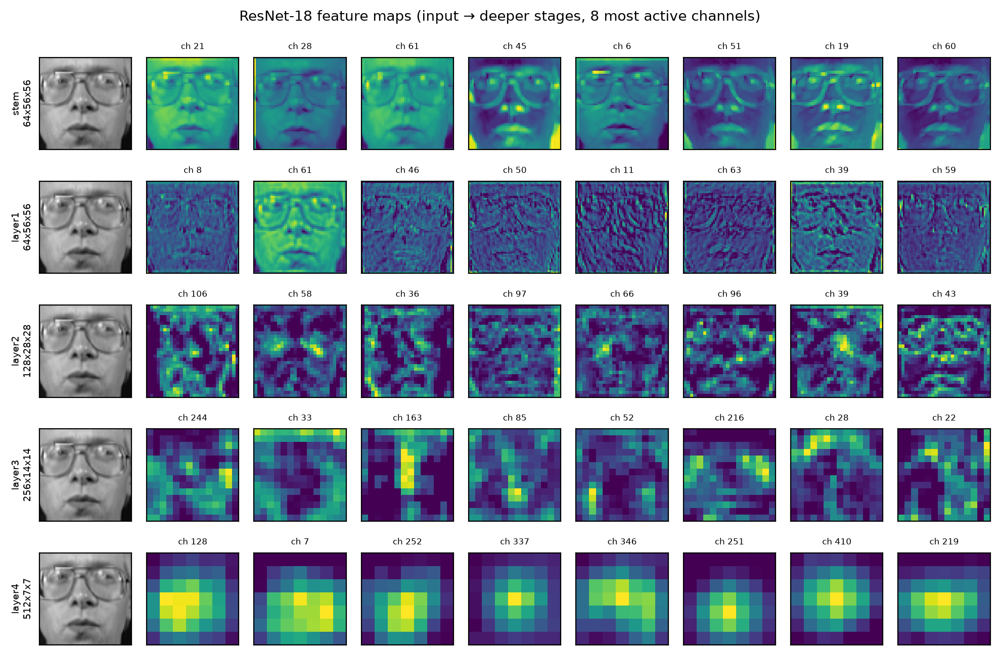

### 5.2. Grad-CAM và attention

CNN pretrained tập trung vào vùng chữ T (mắt, mũi, miệng; miệng và râu với ID 16). SimpleCNN phân tán hơn, có lúc nhìn cả viền má/nền. DeiT trải attention trên toàn khuôn mặt (cả viền tóc, kính) do self-attention toàn cục.

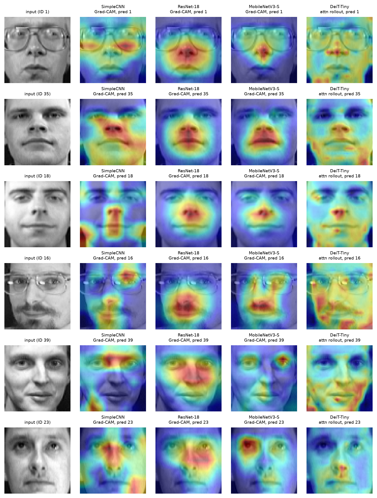

### 5.3. Không gian embedding

Model pretrained tạo 40 cụm gọn, tách biệt; cụm của SimpleCNN lỏng hơn và một số cụm sát nhau, khớp với các lỗi của nó.

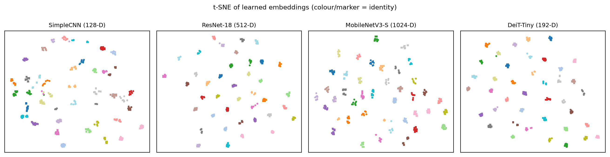

## 6. Thảo luận

- **Pretraining quyết định**: với 280–320 ảnh, SimpleCNN phải học cạnh, bộ phận và danh tính cùng lúc → 95%. Backbone ImageNet đã có sẵn bộ phát hiện cạnh/texture, chỉ cần 5–10 epoch để thích nghi.
- **CNN và ViT**: DeiT-Tiny đạt 98.75%, không hơn CNN. Transformer thiếu prior cục bộ của convolution, cần nhiều dữ liệu hơn.
- **Deep và truyền thống**: trên Olivetti, deep learning chỉ hơn Eigenfaces+SVM 2 ảnh vì dữ liệu đã căn chỉnh và gần bão hoà, nhưng chi phí lớn hơn nhiều (1–11M tham số, PyTorch, weights pretrained). Ưu thế của deep learning sẽ rõ hơn trên ảnh ngoài thực tế (LFW).

## 7. Hạn chế và hướng phát triển

Test nhỏ (80 ảnh) nên các chênh lệch 0–1 lỗi không có ý nghĩa thống kê; nên dùng nhiều lần chia hoặc leave-one-session-out. Huấn luyện trên MPS không bảo đảm giống hệt bit-by-bit giữa các máy (hai lần chạy ở đây cho kết quả giống nhau). Hướng tiếp: thử LFW, ArcFace, so sánh linear probe với fine-tune toàn bộ.

## 8. Kết luận

Fine-tune ResNet-18 và MobileNetV3-Small đạt **100%** accuracy với precision/recall/F1 macro = 1.0; DeiT-Tiny 98.75%; CNN train từ đầu 95%. Hình minh hoạ cho thấy hệ phân cấp đặc trưng cạnh → bộ phận, vùng chú ý mắt–mũi–miệng và các cụm danh tính tách biệt. Đề xuất **MobileNetV3-Small** vì cân bằng giữa độ chính xác và kích thước.

## Cách chạy lại

```bash
cd CNN_computer_vision
python3 -m venv .venv && source .venv/bin/activate
python3 -m pip install -r requirements.txt
python3 main.py
```

## Tài liệu tham khảo

- Samaria & Harter (1994) — ORL / Olivetti faces
- He et al. (2016) — ResNet; Howard et al. (2019) — MobileNetV3
- Dosovitskiy et al. (2021) — ViT; Touvron et al. (2021) — DeiT
- Krizhevsky et al. (2012) — AlexNet; Simonyan & Zisserman (2015) — VGG
- Selvaraju et al. (2017) — Grad-CAM; Abnar & Zuidema (2020) — attention rollout
- van der Maaten & Hinton (2008) — t-SNE; Loshchilov & Hutter (2019) — AdamW
